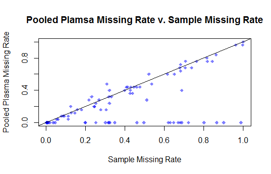
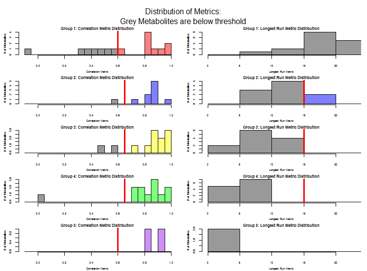
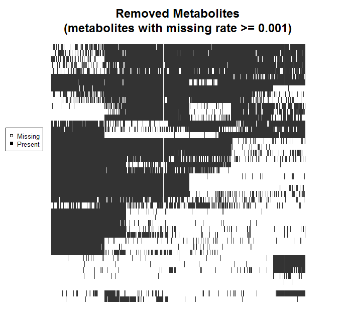
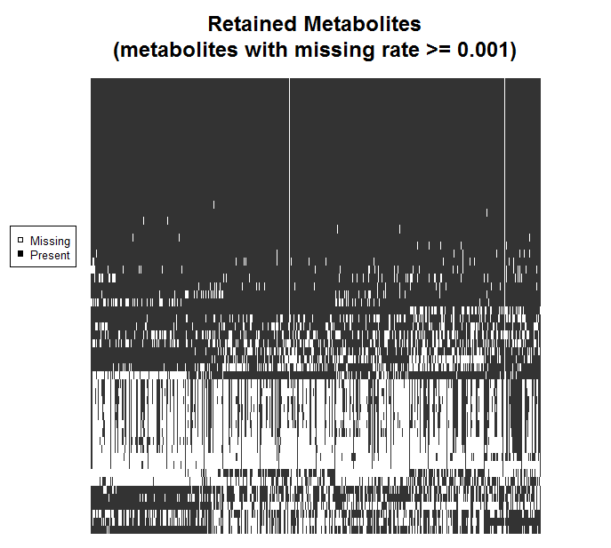

##Introduction
In untargeted metabolomics experiments, extra care must be taken to ensure that measurement artifacts are separated from true metabolites. Given that these studies identify metabolites with unknown signals, some signals detected may not be those of real metabolites, but rather are the result of contamination, miscalibration, or some other unknown factor. The goal of `MetProc` is to provide a simple and convenient set of metrics to help distinguish true metabolites from likely measurement artifacts by assessing patterns of missing data across an injection order.

The following brief tutorial will outline the metrics employed in `MetProc` and provide some simple examples of how to properly execute the functions. All functions assume that pooled plasma samples, either derived from biological samples or from an industry standard, are intermittently included throughout the injection order. Additionally, it is assumed that biological samples have been randomized in their injection order.

##Data Setup
All functions assume a basic structure to the metabolomics data. Specifically, it is assumed that pooled plasma samples (either derived from biological samples or an industry standard) are intermittently measured throughout the randomized injection order of biological samples. These quality control samples are commonly employed in untargeted metabolomics experiments [1]. There may be multiple header lines and multiple leading columns in the file. Typically a csv or tab-delimited file will contain the data of interest. The file will generally be formatted similarly to:

| |   |   | | | |     |
|:-|:--:|:--:|:--:|:--:|:--:|:--:|:--:|:--:|:--:|:--:|:--:|:--:|:--:|:--:|:--:|
|    |  |    |  |  | |Date|415|415|...|415|415|415|...|415|415|
|    |  |    |  |  | |Inject|1|2|...|21|22|23|...|42|43|
|Meta|Meth|HMDB|m/z|rt|Com|ProcID|PPP01|1|...|20|PPP02|21|...|40|PPP03|
|M1|Lipid|H1|304.3|8.71||1|6.7E5|6.7E5|...|5.0E5|6.7E5|4.7E5|...|6.5E5|6.7E5|
|M2|Lipid|H2|309.5|7.64||2|1.0E5|1.1E5|...|1.1E5|1.0E5|1.2E5|...|1.1E5|1.0E5|
|...|...|...|...|...|...|...|...|...|...|...|...|...|...|...|...|
|M100|Lipid|H100|249.4|6.24||100|2.3E4|1.9E4|...|2.2E4|2.4E4|1.6E4|...|1.8E4|2.4E4|

To read in a dataset structured like the table above, we can use the following code:

```
library(MetProc) #Load package
metdata <- read.met(system.file("extdata/sampledata.csv", package="MetProc"),
headrow=3, metidcol=1, fvalue=8, sep=",", ppkey="PPP", ippkey="BPP")
```

The `read.met` function takes a path to a csv, or other text-delimited file. In this case, we are using the "sampledata.csv" file that accompanies the `MetProc` package. The remaining arguments require the row number containing the header line (`headrow=3`), the column number containing the metabolite ID (`metidcol=1`), the column number where metabolite readings begin (`fvalue=8`), the delimiter of the file (`sep=","`), the prefix accompanying the biological sample-based pooled plasma samples (`ppkey="PPP"`), and the prefix accompanying the industry standard-based pooled plasma samples, if necessary (`ippkey="BPP"`). In this case, there are no industry standard-based pooled plasma samples in our data (there are just biological sample-derived pooled plasma samples), so the default of `ippkey="BPP"` will have no effect and can just be left as above. If there were a second type of pooled plasma, then it is important that the `ippkey` argument be properly used. An additional argument, `sidkey`, can be provided if biological samples have a unique prefix -- in this case all biological samples are simple integers without a designating prefix and will be appended the prefix "X" by the `read.met` function. If there is no designating prefix for biological samples, the `read.met` function will assume any column that does not have the `ppkey` or `ippkey` prefix is a biological sample.

Once run, the metabolomics data will be stored in a matrix called `metdata` with rows that are metabolites and columns that are samples:

```{r, echo=FALSE, results='asis',include=F}
library(MetProc) #Load package
metdata <- read.met(system.file("extdata/sampledata.csv", package="MetProc"),
headrow=3, metidcol=1, fvalue=8, sep=",", ppkey="PPP", ippkey="BPP")
```

```{r, echo=FALSE, results='asis'}
knitr::kable(metdata[1:5,1:7])
```

It's important to ensure that missing data are coded as `NA` appropriately.

##Separating Metabolites
Three metrics are used to separate metabolites into likely measurement artifacts and likely true metabolites. The function to run this analysis is `met_proc`. The metrics used are:

1. **Pooled Plasma Missing Rate**: For each metabolite, a pooled plasma missing rate is obtained. Metabolites detected in the majority of pooled plasma samples are likely true metabolites as the pooled plasma is designed to represent a combination of all samples. The default cutoff used for this metric in `met_proc` is 0.02. Any metabolite with a pooled plasma missing rate less than or equal to this cutoff is automatically retained. Metabolites with extremely large pooled plasma missing rates (default > 0.95) are automatically removed as this would suggest that the signal is not real.

2. **Correlation of Missing Rates Across Blocks**: For each metabolite, the injection order can be broken into blocks consisting of biological samples and flanking pooled plasma samples. For instance, this structure would be something like the following:

| | | | | | | | | | | | | |
|-|-|:-:|-|-|-|:-:|-|-|-|:-:|-|-|
|||**Block1**||||**Block2**||||**Block3**||||
|<span style="color:red">PPP01</span>|<span style="color:red">1</span>|<span style="color:red">...</span>|<span style="color:red">20</span>|<span style="color:red">P</span><span style="color:blue">P</span><span style="color:red">P</span><span style="color:blue">0</span><span style="color:red">2</span>|<span style="color:blue">21</span>|<span style="color:blue">...</span>|<span style="color:blue">40</span>|<span style="color:blue">P</span><span style="color:green">P</span><span style="color:blue">P</span><span style="color:green">0</span><span style="color:blue">3</span>|<span style="color:green">41</span>|<span style="color:green">...</span>|<span style="color:green">60</span>|<span style="color:green">P</span><span style="color:yellow">P</span><span style="color:green">P</span><span style="color:yellow">0</span><span style="color:green">4</span>|

For each block, a pooled plasma missing rate and a biological samples missing rate can be calculated. The pooled plasma missing rate will be either 0, .5, or 1 as there are two pooled plasma samples per block. A correlation is taken between the biological sample missing rate and pooled plasma missing rate across blocks. High correlations are indicative of structure in the missing data (some sections of missing data and some sections of present data) which suggests the metabolite may be a measurement artifact. Removing metabolites with correlations above roughly 0.6 or 0.65 seems to be a reasonable place to start.

3. **Longest Run of Present Data Across Blocks**: Similar to the correlation metric, the injection order is separated into blocks. However, in this case, a block is defined as just the preceding pooled plasma and following biological samples:

| | | | | | | | | | | | |
|:-:|:-:|:-:|:-:|:-:|:-:|:-:|:-:|:-:|:-:|:-:|:-:|
||**Block1**|||    |**Block2**|||    |**Block3**||||
|<span style="color:red">PPP01</span>|<span style="color:red">1</span>|<span style="color:red">...</span>|<span style="color:red">20</span>|<span style="color:blue">PPP02</span>|<span style="color:blue">21</span>|<span style="color:blue">...</span>|<span style="color:blue">40</span>|<span style="color:green">PPP03</span>|<span style="color:green">41</span>|<span style="color:green">...</span>|<span style="color:green">60</span>|

For each block, if the missing rate of the biological samples in that block is less than a certain threshold (default 0.5) the data is deemed present. Any block with data deemed present in the biological samples and with data present in the pooled plasma sample is considered to be a "data present" block. The longest run of consecutive "data present" blocks is calculated. Metabolites with particularly long runs are considered to have structure in their missing data which is more indicative of a measurement artifact. This metric should not be applied to metabolites with low overall missing rates as data will be simply be present creating long runs, but the metabolite is likely a true signal if it has a low missing rate. The longest run metric is more useful for metabolites with higher missing rates.

To avoid applying the longest run metric to certain groups of metabolites (for instance those with relatively low missing rates), the strategy employed is to separate metabolites into groups based on pooled plasma missing rates. For example, the default parameters separate all metabolites with pooled plasma missing rates between 0.02 and 0.95 into 5 evenly spaced groups: 0.02 - 0.206, 0.206 - 0.392, 0.392 - 0.578, 0.578 - 0.764, and 0.764 - 0.95. For each group, a different threshold for both the correlation metric and longest run metric can be applied. This allows some flexibility in how to filter metabolites.

To separate the metabolites using the default settings and avoid generating any plots (which can be time consuming with many metabolites and samples), the following code can be used:
```
library(MetProc) #Load package

metdata <- read.met(system.file("extdata/sampledata.csv", package="MetProc"),
headrow=3, metidcol=1, fvalue=8, sep=",", ppkey="PPP", ippkey="BPP")

results <- met_proc(metdata,plot=F)
```

The list `results` contains 2 elements, one containing a matrix of retained metabolites (key: `keep`) and one containing a matrix of removed metabolites (key: `remove`). 

We can see these retained metabolites (56 in total):

`dim(results[['keep']])`

`results[['keep']]`

```{r, echo=FALSE, results='asis',include=F}
results <- met_proc(metdata,plot=F)
```
```{r, echo=FALSE, results='asis'}
dim(results[['keep']])
knitr::kable(results[['keep']][1:5,1:7])
```

As well as the removed metabolites (44 in total):

`dim(results[['remove']])`

`results[['remove']]`

```{r, echo=FALSE, results='asis'}
dim(results[['remove']])
knitr::kable(results[['remove']][1:5,1:7])
```

##Visualizations
There are 3 main visualizations provided by `MetProc`. When running the `met_proc` function, setting `plot=TRUE` will generate a PDF saved to `outfile` that contains all these visualizations automatically. Alternatively, you can generate them using the specific functions although generally setting the argument `plot=TRUE` in the `met_proc` function is simpler. Here I will outline the syntax to use the individual plotting functions if desired.

The first plot demonstrates the correspondence of pooled plasma missing rate and biological sample missing rate across metabolites. The code to run is simply:

`plot_pp_sample_missing(metdata)`

Which yields:

 

In general, there is good correspondece between the two missing rates. Additionally, some metabolites have very low pooled plasma missing rates but large biological sample missing rates. These are likely true metabolites that would be overlooked if simply applying a missing rate cutoff.

The second plot we can look at is the distribution of the longest run and correlation metrics for each group of data. This can be done with one command using the default number of splits (`5`), the default minimum pooled plasma missing rate (`0.02`), the default maximum pooled plasma missing rate (`0.95`), and the default thresholds for deeming a metabolite as an artifact or true metabolite:

`plot_metric(metdata,histcolors=c('red','blue','yellow','green','purple'))`

 

This allows one to visualize the number of metabolites over thresholds in each of the groups. It may also be useful to help set the threshold criteria to use in the analysis. In this case, we see that the longest run metric isn't removing many metabolites at the threshold of `15` in groups 2, 3, and 4. Conversely, the correlation metric removes substantially more at the given cutoffs (the colored metabolites).

The final plots are a way to visualize the patterns of missingness for data. We may want to see if the metabolites removed have structure in their missing data whereas the metabolites retained seem to not have structure in their missing data. 

We can see the removed metabolites with the following:

`heatmap_res(results[['remove']],'PPP','X',missratecut=0.001,'Removed Metabolites')`



This plots the `results[['remove']]` metabolites, with pooled plasma key `ppkey="PPP"`, biological sample key `"X"`, a minimum missing rate to plot of `missratecut=0.001`, and a title of `Removed Metabolites`.

And likewise for the retained metabolites:

`heatmap_res(results[['keep']],'PPP','X',missratecut=0.001,'Retained Metabolites')`



By specificying `missratecut=0.001` we avoid plotting missing data patterns for metabolites that have no missing data. This helps to save time in plotting as clustering these metabolites can be computationally expensive.

In general, we see that the metabolites retained either have the vast majority of data present, or what appears to be a fairly random scattering of missing data. Given the randomization of biological sample injections, this suggests that these metabolites are likely real. Conversely, the removed metabolites seem to have clear block structures with data present at some parts of the injection order and data absent in other parts. With a randomized injection order, this is indicative of some measurement artifact. Additionally, metabolites with overall high missing rates are removed.

In general, as previously noted, the most effective way to generate these plots is to specify `plot=TRUE` when running the `met_proc` function.


##Examples Without Default Settings
The previous example used the default thresholds and criteria for analysis. We can also change these settings and see the results. The thresholds for the correlation metric and longest run metric can be altered to varying effect. Default criteria for the default 5 splits are:

1. Correlation metric: `c(.6, .65, .65, .65, .6)`
2. Longest run metric: `c(NA, 15, 15, 15, NA)`

When a metric is `NA`, it will not be considered for that group. If we change the longest run metric cutoffs to `c(15, 15, 15, 15, 15)` as well as the lower limit of pooled plasma missing rate to consider for removal from 0.02 to -0.0001 we see a stark change. (Note: By setting `mincut` to a value slightly less than 0, we essentially remove the lower bound. Setting it to 0 would still automatically retain metabolites with a 0% missing rate for pooled plasma, which generally you would want to do, but just for illustrative purposes let's see what happens when we apply the longest run metric to those metabolites with entirely present data).

```
r <- met_proc(metdata, numsplit=5, cor_rates=c(.6, .65, .65, .65, .6), runlengths=c(15, 15, 15, 15, 15), mincut=-0.0001, maxcut=0.95, scut=0.5, ppkey='PPP', sidkey='X', plot=F )
```

This comes with some warnings (we are trying to take correlations when there is a 0% missing rate in many blocks so no standard deviation can be calculated for the correlation metric), but we see that we lose many metabolites (75 metabolites removed) because the longest run metric finds long runs for the metabolites with all data present. This example illustrates that one must be careful when considering the longest run metric for metabolites with data mostly present.

We can also tweak the threshold to consider data as present in biological samples when computing the longest run metric, the number of splits, and the correlation metric cutoffs. The code below illustrates an example of doing that as well as tweaking a few other parameters:

```
r <- met_proc(metdata, numsplit=7, cor_rates=c(.4, .5, .5, .5, .5, .55, .75), runlengths=c(NA, 5, 5, 5, 5, 5, NA), mincut=0.02, maxcut=0.95, scut=0.4, ppkey='PPP', sidkey='X', plot=F )
```

In this case, we split the metabolites with pooled plasma missing rates between 0.02 and 0.95 into 7 sections evenly distributed across pooled plasma missing rates. The respective cutoffs for the correlation metric and the longest run metric in each of these sections are given by the `cor_rates` and `runlengths` arguments. For the longest run metric, we consider biological samples present in a block if the missing rate is less than 0.4 rather than the default of 0.5. This removes 50 metabolite and retains 50 metabolites.

If we had multiple types of pooled plasma samples, we can specify the particular type to use with the `ppkey` argument. For instance, if we had industry standard pooled plasma samples with the prefix `"BPP"`, we could simply substitute `"BPP"` for `"PPP"` in the above code so that the `met_proc` function considers the alternative pooled plasma columns in the calculations.


##Summary
In general, running the `MetProc` analysis procedure can be a very quick and simple process. In the case where default settings are sufficient, the only commands necessary are:

```
metdata <- read.met(system.file("extdata/sampledata.csv", package="MetProc"))
results <- met_proc(metdata)
write.met(results,'retained_samples.csv',system.file("extdata/sampledata.csv", package="MetProc"),
type='keep')
write.met(results,'removed_samples.csv',system.file("extdata/sampledata.csv", package="MetProc"),
type='remove')
```

These 4 lines of code read in the data, process the data into metabolites to keep and metabolites to remove using the `met_proc` process, and stores 2 csv files, one for the removed metabolites and one for the retained metabolites.


##References
[1] Dunn WB et al. (2011). Procedures for large-scale metabolic profiling of serum and plasma using gas chromatography and liquid chromatography coupled to mass spectrometry. Nat Protoc, 6(7), 1060-83.
